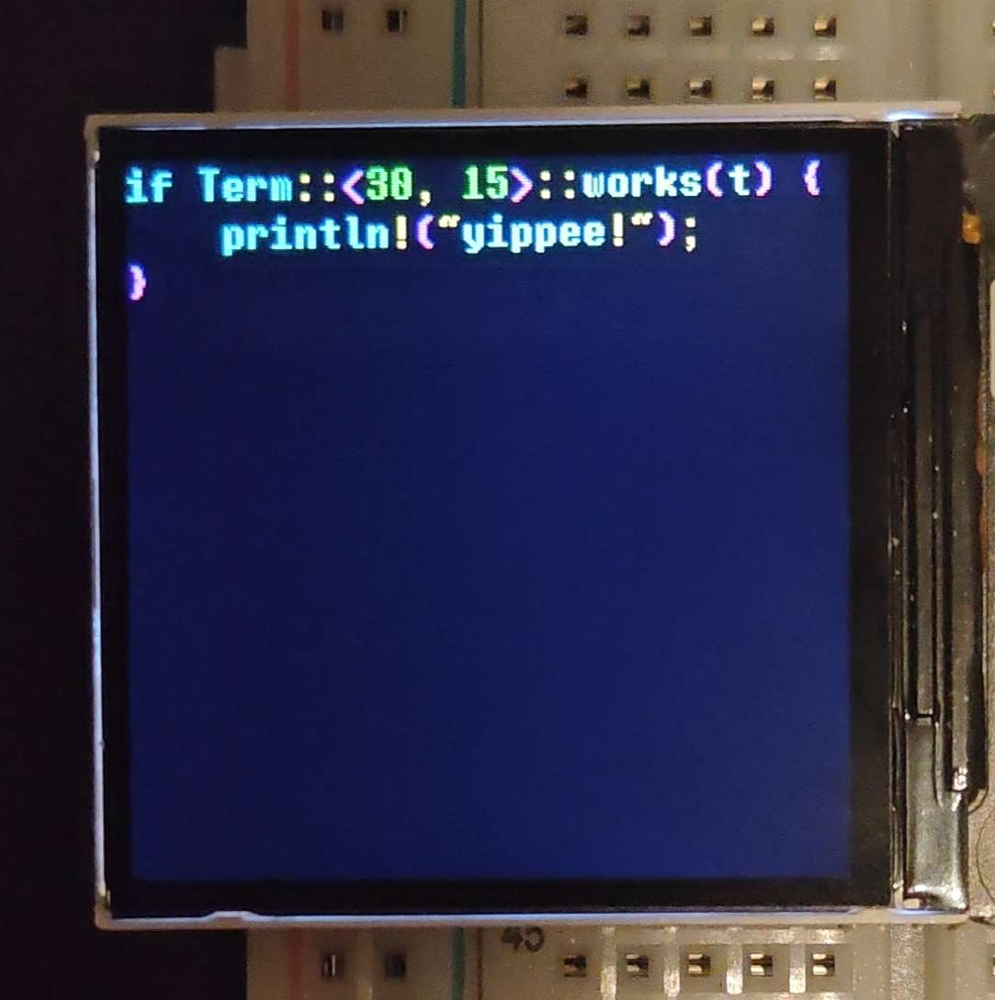

# `lcdterm`

Use any RGB565 LCD as a terminal! 



I might make this a full GUI library, but for now it's just supposed
to be a terminal (**not** ANSI). We want:

- [x] Lazily write ascii to any location on the terminal, and then flush
  to display...
  - [ ] as efficiently as possible (prepare new window only when needed)
- [ ] Background and foreground colors for all letters
- [ ] Scrollable sections -- mark a region as scrollable in the x or y
  direction and have it scroll pixel by pixel*
- [x] Easy interface to drivers, for basically any rgb565 display.
  - [x] With out of the box driver for ST7789
- [x] low memory footprint

*I only plan for this to be added as a "scroll by a char" option. This
means that the terminal should always be aligned to a char boundary, and
half-chars are only displayed during the scrolling step.

## Some Notes on Memory Footprint

### The Font

The font takes up only as much space as the `bmi` does, which will never
exceed `128 * (8 * 16)` bits (`2048` bytes). This goes in ROM.

### The `Term` struct

A 30 x 15 terminal will take up 2250 bytes. That's a lot!

You will need a `Term` to use this. A terminal stores its state lazily,
so you can make a bunch of changes to it and then `display()` to flush
them all to the screen. However, if you just want to display a character 
immediately and don't wnat to deal with the memory footprint of a `Term`
you could do something like this

```rs
let mut lcd: impl Lcd = ...;

Term::<30, 15>::display_immediately(
    &mut lcd,
    (x, y),
    Char {
        value: b,
        foreground: Rgb16::WHITE,
        background: Rgb16::BLACK,
    },
);
```

Note that this doesn't initialize the background of all cells, so you'll
need to do that manually.